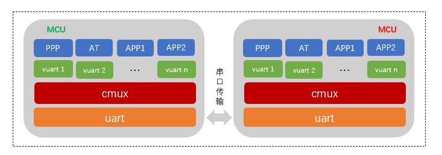

# CMUX

## 1. 简介

- cmux 软件包，是 RT-Thread 针对 GSM0707 / GSM0710 功能实现的软件包。它可是实现在一个真实物理通道上虚拟出多个通道，在一条物理串口接口上实现多个数据链路连接，使得可以同时在一个物理串口接口上存在多个会话。通过多路复用协议和蜂窝模组通讯，使得可以在拨号上网时可以同时拨打电话和收发短信。

  cmux 软件包特点如下：

  - 支持多种蜂窝模块；
  
  * 可以添加 PPP 功能

  目前 CMUX 功能支持 Luat Air720模块，后续会接入更多蜂窝模块。

  

  对 CMUX 有疑惑，或者对 CMUX 感兴趣的开发者欢迎入群详细了解。

  QQ群：749347156 [<传送门>](https://jq.qq.com/?_wv=1027&k=5KcuPGI)

  CMUX 详细介绍：[<文档>](./docs/cmux_basic.md)

  通过 CMUX 使用 PPP_DEVICE 文档：[<使用文档>](./docs/cmux_port.md)

  ### 1.1 框架图

  

- CMUX 软件包实现得是 cmux-client 的内容
  
- CMUX 是一种类似于传输层的协议，用户使用时无法感知该层

- CMUX 在应用场景中多用于 UART, 如有必要也可以支持 SPI 方式
  
  ### 1.2 目录结构
```shell
cmux
├───docs 
│   └───figures                     // 文档使用图片	
├───class    
│   └───cmux_air720.c               // 针对不同设备
├───sample                          // 示例文件
│   └─── sample.c     
├───inc                             // 头文件
│   └─── cmux.h       
├───src                             // 移植文件
│   └─── cmux.c
├───LICENSE                         // 软件包许可证
├───README.md                       // 软件包使用说明
└───SConscript                      // RT-Thread 默认的构建脚本
```

### 1.3 许可证

cmux 软件包遵循 Apache-2.0 许可，详见 LICENSE 文件。

  ### 1.4 依赖

  - RT-Thread 3.1.0+

## 2. 获取方式

​	**CMUX 软件包相关配置选项介绍**

```c
  [*] cmux protocol for rt-thread.  --->
      [ ] using cmux debug feature (NEW)
      (10) set cmux max frame list length (NEW)
      (uart2) the real cmux serial prot (NEW)
      (3) the number of cmux modem port (NEW)
      (AT+CMUX=0,0,5,127,10,3,30,10,2) the command for cmux function (NEW)
      Version (latest)  --->
```

- **using cmux debug feature:** 开启调试日志功能
- **set cmux max frame list length:** 设置虚拟端口的 frame 链的最大长度
- **the real cmux serial prot:** cmux 使用的真实串口名称
- **the number of cmux modem port:** 蜂窝模块支持的虚拟串口数量
- **the command for cmux function:** 进入 cmux 模式的命令
- **Version:** 软件包版本号

## 3. 使用方式

cmux 软件包初始化函数如下所示：

**cmux 功能启动函数，该函数自动调用**

```c
int cmux_sample_start(void)
{
    rt_err_t result;
    sample = cmux_object_find(CMUX_DEPEND_NAME);
    if(sample == RT_NULL)
    {
        result = -RT_ERROR;
        LOG_E("Can't find %s", CMUX_DEPEND_NAME);
        goto end;
    }
    result =cmux_start(sample);
    if(result != RT_EOK)
    {
        LOG_E("cmux sample start error. Can't find %s", CMUX_DEPEND_NAME);
        goto end;
    }
    LOG_I("cmux sample (%s) start successful.", CMUX_DEPEND_NAME);
#ifdef CMUX_AT_NAME
    result = cmux_attach(sample, CMUX_AT_PORT,  CMUX_AT_NAME, RT_DEVICE_FLAG_DMA_RX, RT_NULL);
    if(result != RT_EOK)
    {
        LOG_E("cmux attach (%s) failed.", CMUX_AT_NAME);
        goto end;
    }
    LOG_I("cmux object channel (%s) attach successful.", CMUX_AT_NAME);
#endif
#ifdef CMUX_PPP_NAME
    result = cmux_attach(sample, CMUX_PPP_PORT, CMUX_PPP_NAME, RT_DEVICE_FLAG_DMA_RX, RT_NULL);
    if(result != RT_EOK)
    {
        LOG_E("cmux attach %s failed.", CMUX_PPP_NAME);
        goto end;
    }
    LOG_I("cmux object channel (%s) attach successful.", CMUX_PPP_NAME);
#endif

end:
    return RT_EOK;
}
// 自动初始化
INIT_APP_EXPORT(cmux_sample_start);
// 命令导出到MSH( cmux_sample_start 变更为cmux_start )
MSH_CMD_EXPORT_ALIAS(cmux_sample_start, cmux_start, a sample of cmux function);
```

* 模块进入 cmux 模式，注册 AT 和 PPP 接口到 CMUX 上；


模块上电后，自动初始化流程如下：

```shell
 \ | /
- RT -     Thread Operating System
 / | \     4.0.2 build Apr 14 2020
 2006 - 2019 Copyright by rt-thread team
lwIP-2.0.2 initialized!
[I/sal.skt] Socket Abstraction Layer initialize success.
[I/ppp.dev] ppp_device(pp) register successfully.
[I/cmux] cmux rely on (uart3) init successful.
[I/cmux.air720] cmux has been control uart3.
msh >[W/chat] <tx: AT, want: OK, retries: 10, timeout: 1> timeout
[I/cmux.sample] cmux sample (uart3) start successful.
[I/cmux.sample] cmux object channel (cmux_at) attach successful.
[I/cmux.sample] cmux object channel (cmux_ppp) attach successful.
```

设备上电初始化完成，模块提示模块已经进入 CMUX 模式，可以使用已经注册的虚拟串口。


你也可以同时使用 PPP_DEVICE 提供 ppp 功能，效果如下：

```shell
 \ | /
- RT -     Thread Operating System
 / | \     4.0.2 build Apr 14 2020
 2006 - 2019 Copyright by rt-thread team
lwIP-2.0.2 initialized!
[I/sal.skt] Socket Abstraction Layer initialize success.
[I/ppp.dev] ppp_device(pp) register successfully.
[I/cmux] cmux rely on (uart3) init successful.
[I/cmux.air720] cmux has been control uart3.
msh >[I/cmux.sample] cmux sample (uart3) start successful.
[I/cmux.sample] cmux object channel (cmux_at) attach successful.
[I/cmux.sample] cmux object channel (cmux_ppp) attach successful.
msh >ppp_start
[I/ppp.dev] ppp_device connect successfully.
ping www.baidu.com
60 bytes from 39.156.66.14 icmp_seq=0 ttl=49 time=126 ms
60 bytes from 39.156.66.14 icmp_seq=1 ttl=49 time=129 ms
60 bytes from 39.156.66.14 icmp_seq=2 ttl=49 time=111 ms
60 bytes from 39.156.66.14 icmp_seq=3 ttl=49 time=111 ms
msh >ready
msh >[D/main] cmux control channel has been open.
[D/main] write data : 9
[D/main] 15 ,Recieve  
+CSQ: 29,99

[D/main] 6 ,Recieve  
OK
```
在使用 PPP 功能的同时，可以使用虚拟出的 cmux_at 串口同时读取模块信号强度值，具体可以参考[<移植文档>](./docs/cmux_port.md)

## 4. 注意事项

* 使用 PPP 功能详情参考 [PPP_DEVICE](https://github.com/RT-Thread-packages/ppp_device)
* 只有在虚拟串口注册到 rt_device 框架后才能通过 rt_device_find 找到虚拟串口，要注意先后顺序
* 虚拟串口 attach 后并不能直接使用，必须通过 rt_device_open 打开后才能使用，符合 rt_device 的操作流程

## 5. 联系方式

联系人：xiangxistu

Email: liuxianliang@rt-thread.com

## 6. 致谢

感谢网友 @ya-jeks 在 github 上的 gsmmux 参考代码