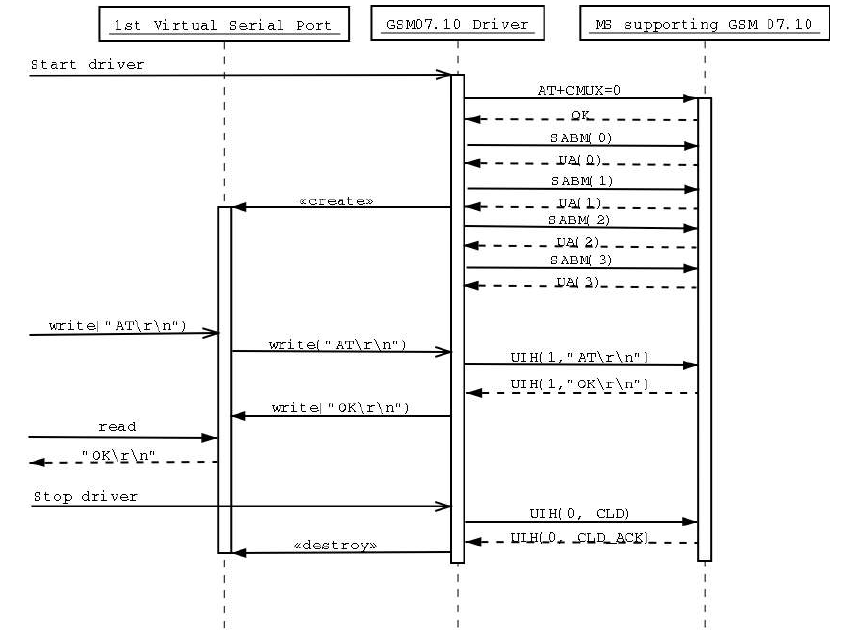
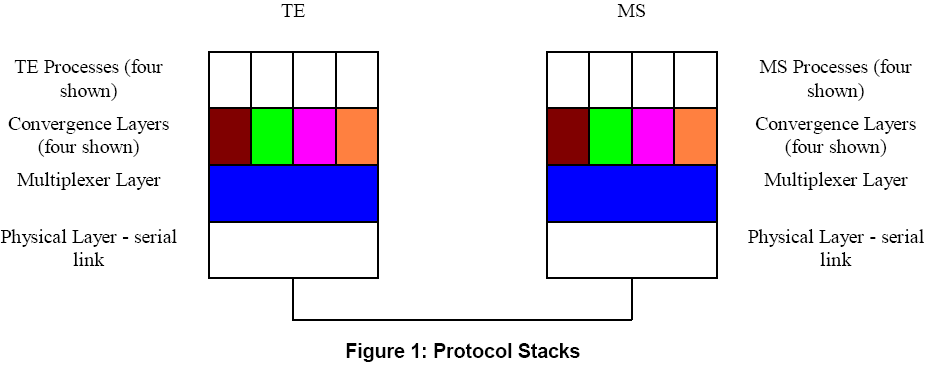
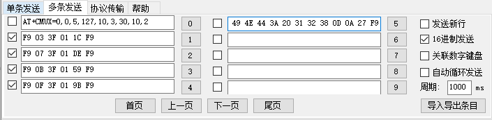

# CMUX 功能

## 1. CMUX 的实现原理

GSM 07.10 协议支持



​    以上是一次 CMUX 建立，通话和销毁的基本流程，因为牵扯到真实串口到虚拟串口的交互，所以可以在一个物理串口上同时实现多个功能。在 PPP 拨号启用时，仍然可以调用 AT 命令，也可以使用 Modem 功能同时支持数据通话。

## 2. CMUX 的实现协议

​	多路复用协议提供在单个物理通信通道之上虚拟出多个并行的逻辑通信通道的能力，一般应用于TE(Terminal Equipment)与MS(Mobile Station)之间，TE相当于智能手机的AP端，MS相当于智能手机的MODEM端。多路复用协议的实现效果如图：



>    实际使用中，TE 端的 MUX 向 MS 端的 MUX 发起通道建立请求，设置通道参数等，是主动的一方；
>
>   MS端的MUX等待TE端的服务请求，根据自身能力提供相应服务。

1. **启动CMUX服务** ：向模块发送 AT + CMUX 命令
2. **建立DLC服务**  ：建立数据连接
3. **数据服务**
4. 功耗控制
5. **释放DLC服务**
6. **关闭服务**
7. 控制服务

#### 2.1 CMUX 数据格式

| Flag        | Address | Control |   Length   | Information | FCS    | Flag        |
| ----------- | ------- | ------- | :--------: | ----------- | ------ | ----------- |
| 0xF9(basic) | 地址域  | 控制域  | 数据域长度 | 实际数据域  | 校验域 | 0xF9(basic) |

**地址域：**

| Bit No. | 1    | 2    | 3    | 4    | 5    | 6    | 7    | 8    |
| ------- | ---- | ---- | ---- | ---- | ---- | ---- | ---- | ---- |
| Signal  | EA   | C/R  | DLCI | DLCI | DLCI | DLCI | DLCI | DLCI |

**控制域：**

| Frame  Type                                   | 1    | 2    | 3    | 4    | 5    | 6    | 7    | 8    | 备注 |
| --------------------------------------------- | ---- | ---- | ---- | ---- | ---- | ---- | ---- | ---- | ---- |
| SABM (Set Asynchronous Balanced Mode)         | 1    | 1    | 1    | 1    | P/F  | 1    | 0    | 0    |      |
| UA (Unnumbered Acknowledgement)               | 1    | 1    | 0    | 0    | P/F  | 1    | 1    | 0    |      |
| DM (Disconnected Mode)                        | 1    | 1    | 1    | 1    | P/F  | 0    | 0    | 0    |      |
| DISC (Disconnect)                             | 1    | 1    | 0    | 0    | P/F  | 0    | 1    | 0    |      |
| UIH(Unnumbered Information with Header check) | 1    | 1    | 1    | 1    | P/F  | 1    | 1    | 1    |      |
| UI (Unnumbered Information)                   | 1    | 1    | 0    | 0    | P/F  | 0    | 0    | 0    | 可选 |

1. SABM SABM命令帧，异步平衡模式
2. UA  UA回应帧，对SABM和DISC这两个命令帧的确认
3. DM  如果在链路断开状态，收到DISC命令，就应该发一个DM作为响应
4. DISC DISC命令用于终止通道
5. UIH  UIH命令帧/响应帧，相对于 UI 帧只对地址域，控制域和长度域校验
6. UI  UI命令帧/响应帧

## 3. CMUX 协议的验证平台及验证方法

STM32F407 + Air720H（手动拼接命令测试）

​    使用 AT+CMUX 命令，进入 CMUX 配置功能；测试 CMUX 功能是否正常：

1.  PPP 拨号正常
2.  AT 命令查询模块信号强度正常

手动发送的 CMUX 命令：



## 4. CMUX 在 RT-Thread 上的适配

#### 4.1 移植的环境与目标

使用 STM32F407 + Air720H 平台，实现 CMUX 功能；

​    目标是做成软件包的形式，软件包的功能是打开后，将通过 cmux 软件包向上虚拟出 vcom1, vcom2, vcom3 以代表 ppp, at, modem 这些接口，向下接管真实物理串口，通过 cmux 协议解析数据以实现正常传输。使用时通过 rt_device_find 查找使用，以实现较大的通用性。

#### 4.2 CMUX 框架图定义和介绍


1. CMUX 属于串口驱动之上，在通信协议 PPP / AT 之下；主要用于 MCU 和通讯模块在不同通道上面进行不同业务的通信及交互功能；
2. CMUX 分为服务器和客户端部分，服务器与客户端部分实现并不相同；
3. 我们在移植 CMUX 时，客户端与服务器是两个设备，只需要实现 CMUX 客户端部分即可，服务器由通讯模块提供；
4. CMUX 是指在一个物理串口上实现多个虚拟串口设备功能，只能实现在一对一设备上，且双方必须同时支持 CMUX（GSM0707 / GSM0710） 协议； 

#### 4.3 CMUX 的移植参考 

基于 [Github](https://github.com/ya-jeks/gsmmux.git) 上 gsmmux 仓库，该仓库是针对 Linux 系统实现的 CMUX 协议支持；

#### 4.3.1 软件包结构

```shell
cmux
├───docs 
│   └───figures                     // 文档使用图片	
├───inc                             // 头文件
│   │───gsm
│   │   └─── cmux_chat.h    
│   └─── cmux.h       
├───sample                          // 示例文件
│   └─── cmux_sample_gsm.c     
├───src                             // 源码文件
│   ├───gsm
│   │   ├─── cmux_chat.c 
│   │   └─── cmux_gsm.c  
│   ├─── cmux_utils.c
│   └─── cmux.c
├───LICENSE                         // 软件包许可证
├───README.md                       // 软件包使用说明
└───SConscript                      // RT-Thread 默认的构建脚本
```

#### 4.3.2 基础介绍

1. CMUX 的帧结构介绍

   ```c
   struct cmux_buffer
   {
     rt_uint8_t data[CMUX_BUFFER_SIZE];
     rt_uint8_t *read_point;                          // 用于读取 CMUX 数据的指针
     rt_uint8_t *write_point;                         // 指向 CMUX 数据区的指针
     rt_uint8_t *end_point;                           // 指向 CMUX 数据区末尾的指针
     int flag_found;                                  // 是否找到 0xF9 帧头
   };
   
    struct cmux_frame
   {
     rt_uint8_t channel;                             // 地址域
     rt_uint8_t control;                             // 数据帧类型, SABM，UIH，UA; 控制域
     int data_length;                                // 数据长度
     rt_uint8_t *data;                               // 实际数据
   };
   ```
   
2. CMUX 不同帧类型介绍

   ```shell
   // bits: Poll/final, Command/Response, Extension
   #define CMUX_CONTROL_PF 16
   #define CMUX_ADDRESS_CR 2
   #define CMUX_ADDRESS_EA 1
   // the types of the frames
   #define CMUX_FRAME_SABM 47
   #define CMUX_FRAME_UA 99
   #define CMUX_FRAME_DM 15
   #define CMUX_FRAME_DISC 67
   #define CMUX_FRAME_UIH 239
   #define CMUX_FRAME_UI 3
   // the types of the control channel commands
   #define CMUX_C_CLD 193
   #define CMUX_C_TEST 33
   #define CMUX_C_MSC 225
   #define CMUX_C_NSC 17
   // basic mode flag for frame start and end
   #define CMUX_HEAD_FLAG (unsigned char)0xF9
   ```
   

#### 4.3.2 实现

1. 需要实现的结构体

   ```c
   struct cmux
   {
       struct rt_device *dev;                        /* device object */
       const struct cmux_ops *ops;                   /* cmux device ops interface */
       struct cmux_buffer *buffer;                   /* cmux buffer */
       struct cmux_frame *frame;                     /* cmux frame point */
       rt_thread_t recv_tid;                         /* receive thread point */
       rt_uint8_t vcom_num;                          /* the cmux port number */
       struct cmux_vcoms *vcoms;                     /* array */
   
       struct rt_event *event;                       /* internal communication */
   
       rt_slist_t *list;                             /* cmux list */
   
       void *user_data;                              /* reserve */
   };
   
   struct cmux_ops
   {
       rt_err_t  *(start)     (struct cmux *obj);
       rt_err_t  *(stop)      (struct cmux *obj);
       rt_err_t  *(control)   (struct cmux *obj, int cmd, void *arg);
   };
   ```
   

