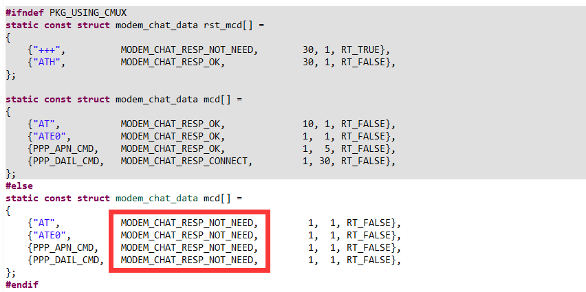
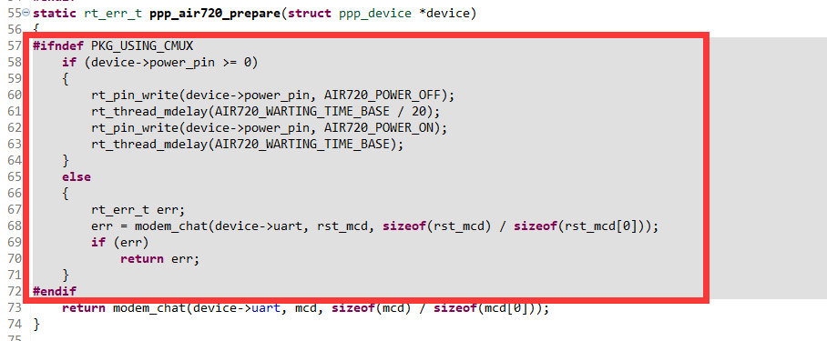

# PPP 功能使用

在 CMUX 中使用 PPP_DEVICE 与直接使用 PPP_DEVICE 的使用差别不大；使用最新版本的 PPP_DEVICE 可以做到 cmux 的兼容效果，无论是打开 cmux 功能均可以正常使用 PPP_DEVICE。


如果使用低版本的 PPP_DEVICE ，务必注意一下几点。

1. 相对于只使用 PPP_DEVICE，CMUX + PPP_DEVICE 组合需要使用 NOT_NEED 设置

   出现这个问题的原因是因为 chat 功能相对简单，匹配回复的字符串时容易受到超时判定的制约，导致提前退出，匹配失败。关闭匹配字符串功能，可以防止错误判断；后面会优化 chat 方法。



2. rst_cmd 是考虑到模块仍在 ppp 状态需要先退出 ppp 功能而考虑的

在使用 cmux + ppp_device 组合时，ppp 拨号的前提就是模块已经进入 cmux 模式，无需发送 rst_cmd 命令



3. 示例中的 ready 功能是测试命令，代码如下

   ```c
   #define DBG_TAG "ready"
   #define DBG_LVL DBG_LOG
   #include <rtdbg.h>
   
   static rt_uint8_t flag = 0;
   struct rt_device *device = RT_NULL;
   rt_err_t result;
   rt_size_t size;
   rt_uint8_t buffer[20];
   rt_size_t count = 0;
   
   static rt_err_t recieve_invkoen(rt_device_t dev, rt_size_t size)
   {
       RT_ASSERT(dev != RT_NULL);
       flag = 1;
       return RT_EOK;
   }
   
   int cmux_ctl_command(void *parameter)
   {
       device = rt_device_find("cmux_at");
       if(device == RT_NULL)
       {
           LOG_E("Sorry, can't find cmux control channel.");
       }
       else
       {
           result = rt_device_open(device, RT_DEVICE_OFLAG_RDWR | RT_DEVICE_FLAG_DMA_RX);
           if(result != RT_EOK)
           {
               LOG_E("Sorry, can't open cmux control channel.");
           }
           LOG_D("cmux control channel has been open.");
       }
       rt_device_set_rx_indicate(device, recieve_invkoen);
   
       size = rt_device_write(device, 0, "AT+CSQ\r\n", sizeof("AT+CSQ\r\n"));
       LOG_D("write data : %d", size);
   
       while(count++ < 500)
       {
           size = rt_device_read(device, 0, buffer, 20);
           if(size != 0)
           {
               buffer[size] = '\0';
               LOG_D("%d ,Recieve  %s", size, buffer);
               flag = 0;
           }
       }
       count = 0;
       return RT_EOK;
   }
   
   int ready(void *para)
   {
       rt_thread_t read_thread = RT_NULL;
   
       read_thread = rt_thread_create("read",
                                       (void (*)(void *parameter))cmux_ctl_command,
                                       RT_NULL,
                                       2048,
                                       25,
                                       20);
       rt_thread_startup(read_thread);
   }
   MSH_CMD_EXPORT(ready, ready);
   ```

   还在考虑直接使用 at_client 功能，敬请期待。